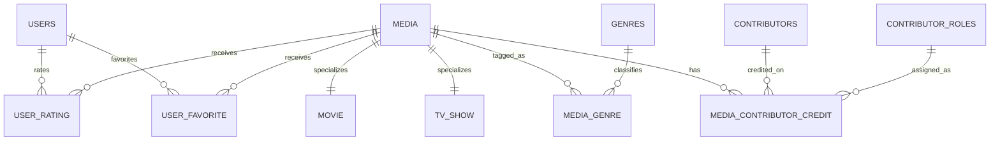

# MediaVault Schema Design

## Scope

MediaVault is a normalized MySQL database for browsing and analyzing movies and TV shows. The schema supports:

- media catalog browsing across two media types: movies and TV shows
- many-to-many relationships for genres and contributors
- contributor role tracking across media domains
- user interactions through ratings and favorites
- complex SQL using joins, aggregations, and views

## ERD

## Design Decisions

### 1. Supertype / subtype modeling

`media` stores attributes shared by all titles:

- title
- media type
- release date
- language
- summary metadata

Subtype tables separate type-specific attributes:

- `movie` stores runtime and box office
- `tv_show` stores seasons, episodes, end date, and show status

This avoids null-heavy columns and keeps the design in 3NF.

### 2. Many-to-many relationships

- `media_genre` resolves the many-to-many relationship between media and genres
- `media_contributor_credit` resolves the many-to-many relationship between media and contributors while also storing role-specific credit data

### 3. Contributor role normalization

Roles such as actor, director, and writer are stored in `contributor_roles` instead of being repeated as free text in every row. That removes redundancy and supports cleaner aggregation queries.

### 4. User activity modeling

- `user_rating` stores one rating per user per media item
- `user_favorite` stores one favorite record per user per media item

These tables keep interaction data independent of catalog metadata.

## Normalization Summary

The schema is designed to satisfy 3NF:

- 1NF: all attributes are atomic; there are no repeating groups
- 2NF: non-key attributes depend on the whole primary key in bridge tables
- 3NF: descriptive attributes depend only on their table key, not on other non-key attributes

Examples:

- genre names are stored once in `genres`, not repeated in `media`
- contributor role names are stored once in `contributor_roles`, not duplicated in credits
- movie-only and TV-only facts are isolated in subtype tables instead of being mixed into one wide table

## Integrity Constraints

The schema uses:

- primary keys on every entity table
- foreign keys for all inter-table relationships
- unique constraints for usernames, emails, genre names, role names, and de-duplicated media identity
- check constraints for score ranges, runtime, box office, season counts, and rating values
- cascade deletes on dependent bridge/activity tables so orphaned rows cannot remain

## Views Included

Two views are included to support later query and application work:

- `vw_media_catalog`: flattened catalog view with subtype details and grouped genre labels
- `vw_contributor_footprint`: contributor credit counts split across movies and TV shows

These support filtering, aggregation, and cross-domain analysis without denormalizing the base schema.

## Files

- `db/schema.sql`: MySQL DDL for the complete schema, indexes, seed role values, and views

## Notes For Later Steps

This schema is ready for:

- sample data loading
- backend API endpoints
- frontend filtering by media type, genre, contributor, and rating
- advanced SQL demonstrations for joins, subqueries, and aggregation
